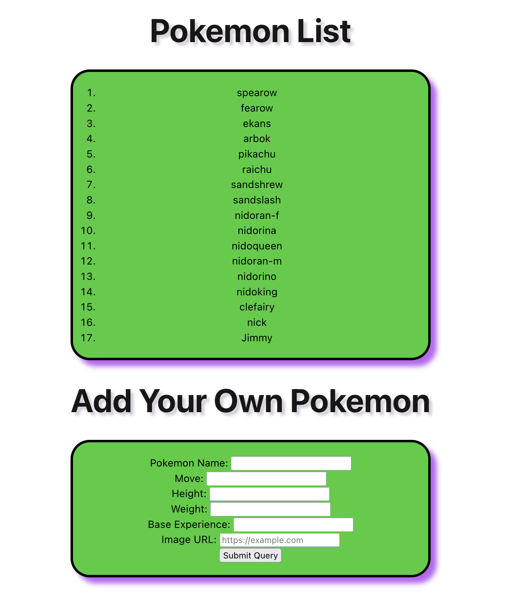
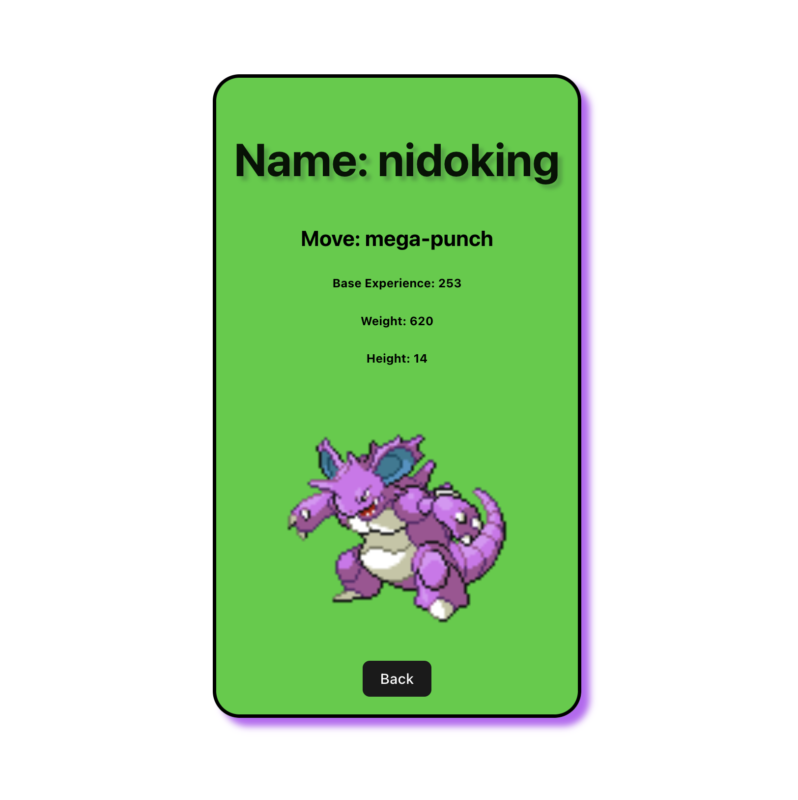
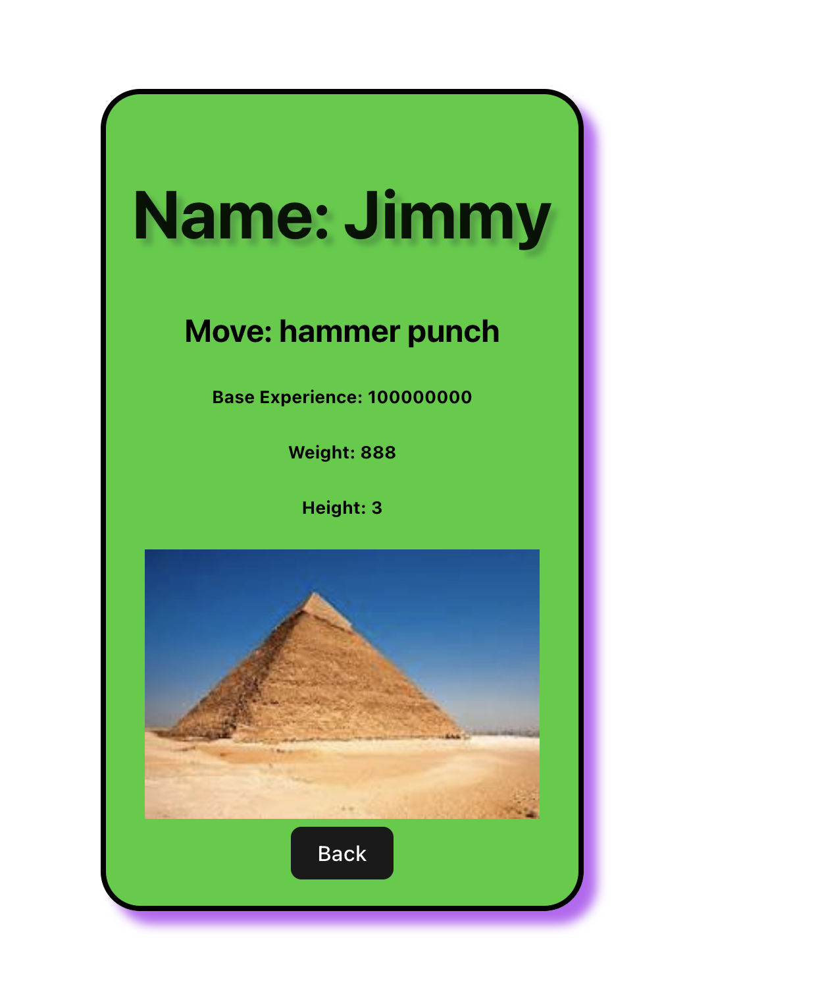

# BLOCK 26 workshop - MORE POKEMON!
## [Check out the deployed Project on Netlify](https://nicks-pokemon-react-api-app.netlify.app/)
### Here are the instructions for today’s workshop.
- Create a React app that retrieves and displays a list of pokemon
- When you click on a pokemon in the list, it should go to a details page displaying more - information about it (probably want a back button as well)
- Add a form that allows the user to create their own pokemon*
---
__Notes__
1.  It took a while to get the API call for the list of pokemon to stop rendering. Rather than move to the App.jsx parent level, I added a bit of logic to skip the API Call by asking, "is there anything in the pokemon list array?" If yes, then skip the fetch.

2. To keep user-added pokemon in state, I added a "created by human" boolean to either call from the API for details, or pull from what the user added. It was a bit of a meandering path to get the logic in the right place -- parent? child? add an in between? Turns out the space that worked the best was just in the child Detail View which had been there all along. NOT in a making an in-between child with a ternary choice based on whether the "created by human" was true and then branching off to two grandchildren, one showing the API detail view, and the other showing the user-added detail view. Both show the same details, but they have different data structures. A tricky Sunday of Coding.

2.  I'm Intentionally leaving the console.logs and unused/commented out missteps to show process.
---
__Screenshots:__

*List View plus Form*

*Detail View (pulling data from Pokemon API)*

*Detail View (pulling user-added data)*

